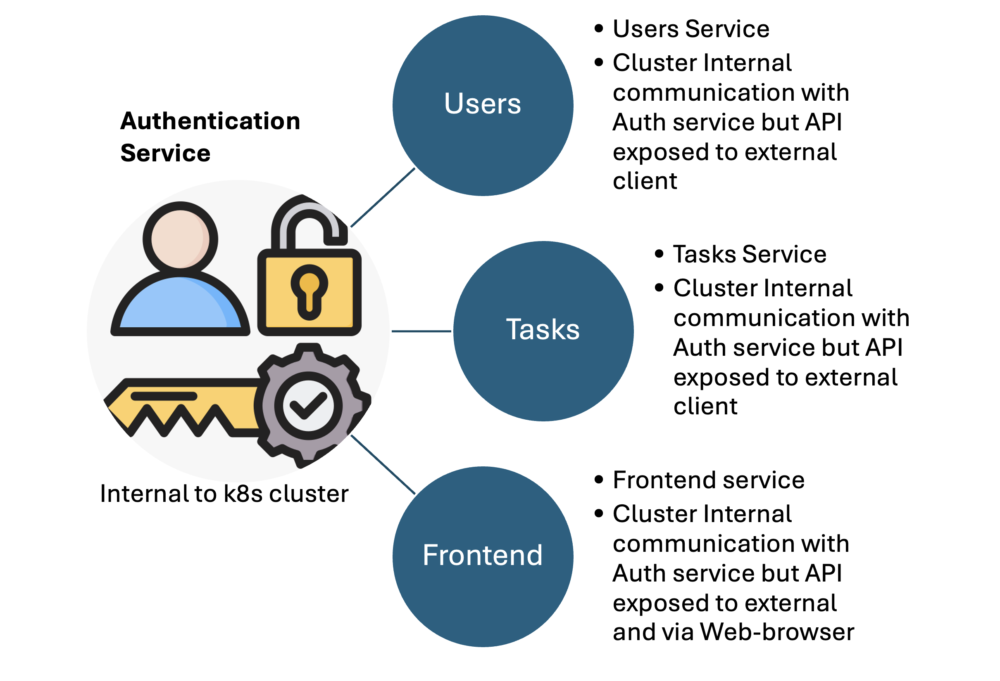

# Kubernetes Multiple-Pods Application:
Kubernetes multiple pods demo application to understand kubernetes internal communication and networking.

## Application Details

1. The demo application backend is using nodeJS backend and frontend is using ReactJS. This a just demo application with more emphasis is laid on kubernetes and API communication. Components like users, tasks, authentication and frontend application are small dummy components just to show the API's communication within k8s landscape.
   
2. This project contains dockerfile which explains how a nodeJS/ReactJS application are containerized using Docker. The docker images are available in my public docker repository [Kreetanshu](https://hub.docker.com/repositories/kreetanshu) 
3. The Kubernetes service and deployment files are stored in this [project](/kubernetes/). 
4. No data persistence: Database is not used here,neither Kubernetes persistent volume are created. Hence data is stored only as long as pods are alive.
5. This project explains the networking concept and communication flow between different components of application. How pod-to-pod/service-to-service or service-to-external-cleints communication is achieved. 

## Kubernetes networks and communication

In the below diagram there are 4 kubernetes services in action. Users, tasks and frontend services are of type `LoadBalancer` which is accessible from outside of k8s cluster, whereas authentication service is of type `ClusterIP` accessible from only within the kubernetes cluster.



The application is tested via deploying the kubernetes [yamls](/frontend/) on a single-node [minikube](https://minikube.sigs.k8s.io/docs/) cluster. Though the other Kubernetes distro should also support this deployment.

The demo application consists of four basic components. These four components are categorised as four different pods/services in k8s deployment.

## Application Components:

**1. Users Service**: This is a Kubernetes microservice for the backend users application responsible for the user authentication. /signup and /login are two API calls available here. Users APIs are exposed to external world by creating a LoadBalancer type kubernetes service, users /login APIs make a call to `authentication service` which authenticate the users and generate a dummy authorization token.

Run minikube service to forward the IP/Ports to your local machine
   ```bash
   minikube service users-service
   ```
Grab the IP and port number for users-service from the output and then construct the /login API call.

POST Request to: http://127.0.0.1:58732/login
Request Body
```json
{
  "email":"test@test.com",
  "password": "test"
}
```
Upon success, a dummy token will be returned. Use this token in header Authorization for tasks and frontend calls.

Response Body
```json
{
  "token": "abc"
}
```
**2. Tasks service**: This is backend mircroservice which stores and retrives tasks from a temporary file based storage mounted within the pod. Task APIs makes a call to `authorization-service` using the authorization in header to authenticate the user. Upon successful authentication it saves or return any stored tasks.

Two APIs are available here: GET and POST /tasks. Frontend application also uses these calls to fetch and create tasks.
First task need to be created using POST call, again run `minikube service tasks-service` to forward the calls to the local machine. 

Grab the port number being used for task-service and construct the POST API call like below.

POST tasks call needs an authorization token in the header and body. Below is an example to create the same:

POST tasks API call: http://127.0.0.1:49219/tasks

In header set the authorization token e.g : Authorization: Bearer abc

Request Body
```json
{
  "text":"Reetanshu's kubernetes network practice",
  "title": "RK K8s practice"
}
```
Response Body
```json
{
  "message": "Task stored.",
  "createdTask": {
    "title": "RK K8s practice",
    "text": "Reetanshu's kubernetes network practice"
  }
}  
```
Once tasks are created they can be fetched using GET call e.g. http://127.0.0.1:49219/tasks with Authorization token set in header.

**3.Frontend Service**: This is a React-js based front-end application which has user-interface for tasks service. This microservice allows users to view the created tasks and also users can create task via UI. This frontend application also needs to authenticate via auth-service before rendering stored tasks results. Frontend service is also a `LoadBalancer` type service which allows connection from external client like Postman or a Web-browser.

Again run the command `minikube service frontend-service` and grab the IP and port number user for frontend application.
There are two APIs call GET and POST tasks are avaible here.

For frontend calls /api needs to be added before /tasks, this /api is a short route path for the task service call. This forwards the request to task API call which in turn makes a call first to the authentication service and then connects to tasks APIs. This is used as reverse-proxy for the frontend application as defined in nginx [configuration](/frontend/conf/nginx.conf)

POST call will be like: http://127.0.0.1:57645/api/tasks

In header set the authorization token e.g : Authorization: Bearer abc

Request Body
```json
{
  "text":"Reetanshu's kubernetes network practice",
  "title": "RK K8s practice"
}
```
Response Body:

```json
{
  "message": "Task stored.",
  "createdTask": {
    "title": "RK K8s practice",
    "text": "Reetanshu's kubernetes network practice"
  }
}  
```
Once tasks are created, tasks can be viewed in frontend UI, `minikube service frontend-service` will open the URL in browser or it can be fetched from minikube console as well.


From API client as well a GET call http://127.0.0.1:57645/api/tasks with Authorization token in header can be made to fetch the same results.

**4.Authentication Service**: This is a backend microservice, which is restricted to outside world. Tasks, Users and Frontend APIs authenticate using the auth-service. The auth-service is of type `ClusterIP` this upon successful authentication grants a Authorization token which needs to be passed in header of other API calls which is accessible from outside or within the k8s cluster.

**Note** These all four applications are dummy applications as more emphasis here is on Kubernetes concepts than the app itself. For more details refer to the source [code](https://github.com/kreetanshu/kubernetes-multi-pods-app) under each app folder

## Deployment: How to get started

1. Install [minikube](https://minikube.sigs.k8s.io/docs/) or any other k8s distribution.
2. Install [kubectl](https://kubernetes.io/docs/tasks/tools/#kubectl) based on the OS
3. Clone the GitHub repository
```bash
git clone https://github.com/kreetanshu/kubernetes-multi-pods-app
```
4. Navigate to kubernetes folder and apply the kubernetes files
```bash
cd kubernetes
kubectl apply -f .
```
5. In-order to access the UI, forward the frontend application


